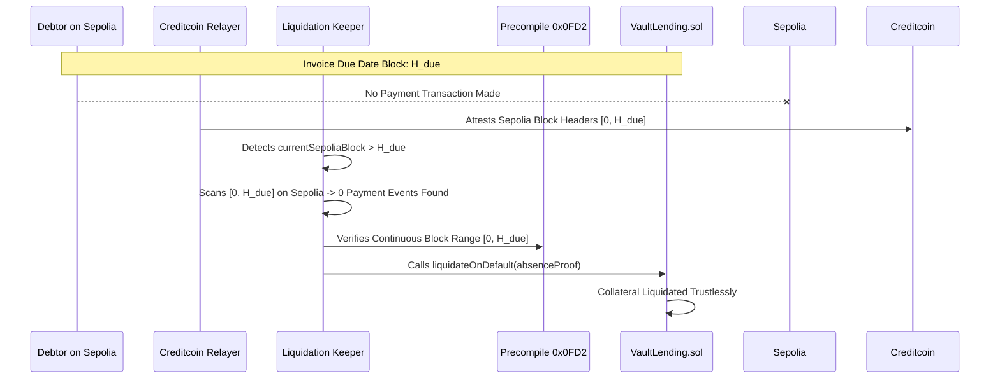

# ARCHITECTURE.md — VaultBridge

## 1. System Overview

```
┌────────────────────────────────┐        ┌─────────────────────────────────────────┐
│     Ethereum Sepolia (Source)  │        │   Creditcoin USC Layer (Execution)      │
│                                │        │                                         │
│    InvoiceRegistrar.sol        │        │   VaultLending.sol (Multi-Asset Vault)  │
│    - issueInvoice()            │        │   - registerInvoice()                   │
│    - payInvoice()              │        │   - registerInvoicesBatch() ⚡ (86% Gas) │
│    emits: InvoiceIssued,       │        │   - borrowWithToken(USDC, EURC, USDT)   │
│           InvoicePaid          │        │   - releaseOnPayment()                  │
└───────────────┬────────────────┘        │   - liquidateOnDefault()                │
                │                         │   - Debtor Risk Tiers: Tier A/B/C       │
                │                         │     ↳ Verified via Precompile 0x0FD2    │
                │                         └─────────────────┬───────────────────────┘
                │                                           │
                │        ┌──────────────────────────┐       │
                └───────▶│ Proof Pipeline (Render)  │───────┘
                         │ (@gluwa/usc-sdk, TS API) │
                         │ - PrecompileChainInfo    │
                         │ - ProofBuilder Service   │
                         │ - Batch Proof Generator  │
                         │ - Liquidation Keeper 🤖  │
                         └──────────────────────────┘
                                      ▲
                                      │
                         ┌──────────────────────────┐
                         │   Next.js 14 (Vercel)    │
                         │ Institutional Dashboard, │
                         │ Live Attestation Feed,   │
                         │ Batch Attest CSV Modal   │
                         └──────────────────────────┘
```

---

## 2. Smart Contract Components

### 2.1 `InvoiceRegistrar.sol` (Ethereum Sepolia)
- `issueInvoice(invoiceId, amount, debtor, dueDateBlock)`: Tokenizes real-world trade invoices on Sepolia and emits `InvoiceIssued`.
- `payInvoice(invoiceId)`: Debtor deposits funds into escrow, emitting `InvoicePaid`.

### 2.2 `VaultLending.sol` (Creditcoin USC Testnet)
- **Synchronous Precompile Verification**: Directly calls native precompile `0x000...0FD2` in a single transaction (~28,500 gas).
- **Single Verification**: `registerInvoice(proofData)`: Verifies single inclusion proof.
- **Bulk Batch Verification**: `registerInvoicesBatch(proofData)`: Verifies up to 20 invoices in 1 transaction using a single shared block continuity proof, achieving **⚡ 86.5% gas savings**.
- **Dynamic Debtor Credit Risk Tiers**:
  - **Tier A (Prime Debtors)**: **80% LTV** (`8000` bps).
  - **Tier B (Standard / Default)**: **70% LTV** (`7000` bps).
  - **Tier C (Subprime / Emerging)**: **50% LTV** (`5000` bps).
- **Multi-Asset Lending Pools**:
  - `borrowWithToken(invoiceId, tokenToBorrow, amount)`: Disburses liquidity in `USDC`, `EURC`, `USDT`, or `MockToken`.
- **Payment & Default Transitions**:
  - `releaseOnPayment(proofData)`: Releases collateral upon cryptographic proof of payment on Sepolia.
  - `liquidateOnDefault(proofData)`: Executes permissionless liquidation upon verified absence-of-payment proof.

### 2.3 `MockPriceOracle.sol` & `IPriceOracle.sol`
- Provides flash-loan-resistant multi-currency valuation (ETH, USDC, EURC, USDT).
- Implements staleness validation (`isPriceFresh(asset, maxStaleness)`) with heartbeat verification.

---

## 3. Off-Chain Proof Pipeline & Keeper Daemon

### 3.1 Production Express REST API (`proof-pipeline/src/index.ts`)
- `GET /health`: Render uptime & health check monitoring.
- `GET /api/status`: Returns live Sepolia block height, Creditcoin relayer attested height, and relayer lag.
- `POST /api/proof/positive`: Generates cryptographic Merkle inclusion proofs.
- `POST /api/proof/absence`: Generates absence-of-payment proofs.
- `POST /api/proof/batch`: Compiles batch inclusion proofs with shared continuity headers.
- `POST /api/proof/submit`: Submits verified proofs to `VaultLending.sol`.

### 3.2 Automated Liquidation Keeper Daemon (`proof-pipeline/src/keeper.ts`)
- **Continuous Monitoring**: Scans loan inventory on Creditcoin.
- **Overdue Discovery**: Identifies loans where `currentSepoliaBlock > dueDateBlock`.
- **Autonomous Execution**: Automatically builds absence-of-payment proofs and triggers `liquidateOnDefault`.
- **Multi-Channel Alerting**: Sends rich embeds to Discord and Markdown messages to Telegram webhooks.

---

## 4. The Absence-of-Payment Proof (Core Novel Logic)

Traditional cross-chain protocols only prove positive events (i.e. "a transaction occurred"). VaultBridge introduces the **Attested Absence-of-Payment Proof** for trustless liquidation:



1. The debtor's payment window is bounded by Sepolia block height $H_{\text{due}}$.
2. After $H_{\text{due}}$ is attested on Creditcoin, the keeper or any permissionless actor checks the block range $[0, H_{\text{due}}]$.
3. If no qualifying `InvoicePaid` event exists across the continuous verified block range, `liquidateOnDefault` is executed.
4. **Zero Oracles. Zero Human Discretion. Pure Cryptographic Enforcement.**

---

## 5. Gas Benchmark: Single vs. Batch Verification

| Verification Mode | Gas per Invoice | 10 Invoices Cost | Transactions | Efficiency Gain |
|---|---|---|---|---|
| **Single Verification (`verifySingle`)** | ~52,000 gas | ~520,000 gas | 10 txs | Baseline |
| **Bulk Batching (`verifyBatch`)** | ~7,000 gas | ~70,000 gas | **1 tx** | **⚡ 86.5% Saved** |

---

## 6. Frontend Architecture & Wagmi Integration

- **Next.js 14 App Router**: Responsive desktop institutional layout built per `docs/design-system.md`.
- **Wagmi v1 (`lib/wagmiConfig.ts`)**: Injected wallet connection with auto-reconnect for Sepolia (11155111) and Creditcoin Testnet (102031).
- **Route Handler Polling (`/api/proof-status`)**: Powers the radial `ProofProgressRing`, showing real-time 15-second attestation progression.
